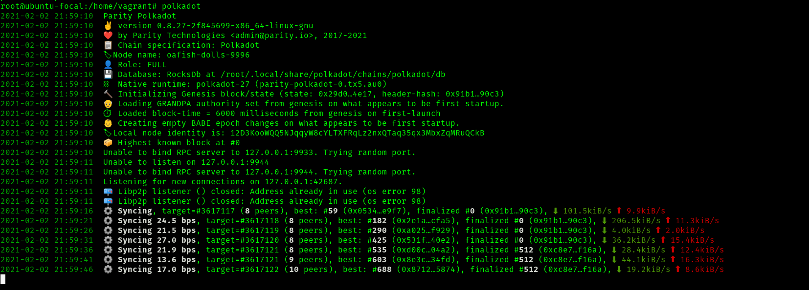

Debian based install
++++++++++++++++++++++++++++++++++++++

Debian install can be performed on a node running Ubuntu 20.04.

Follow the following steps to get a node up and running :

.. code-block:: bash

    gpg --recv-keys --keyserver hkps://keys.mailvelope.com 9D4B2B6EB8F97156D19669A9FF0812D491B96798
    gpg --export 9D4B2B6EB8F97156D19669A9FF0812D491B96798 > /usr/share/keyrings/parity.gpg
    echo 'deb [signed-by=/usr/share/keyrings/parity.gpg] https://releases.parity.io/deb release main' > /etc/apt/sources.list.d/parity.list
    apt update
    apt install parity-keyring
    apt install polkadot

Installation from the debian or repository will create a ``systemd`` service that can be used to run a Polkadot node.
This is disabled by default, and can be started by running :

.. code-block:: bash

   systemctl start polkadot
   polkadot

The node will be up as shown :

