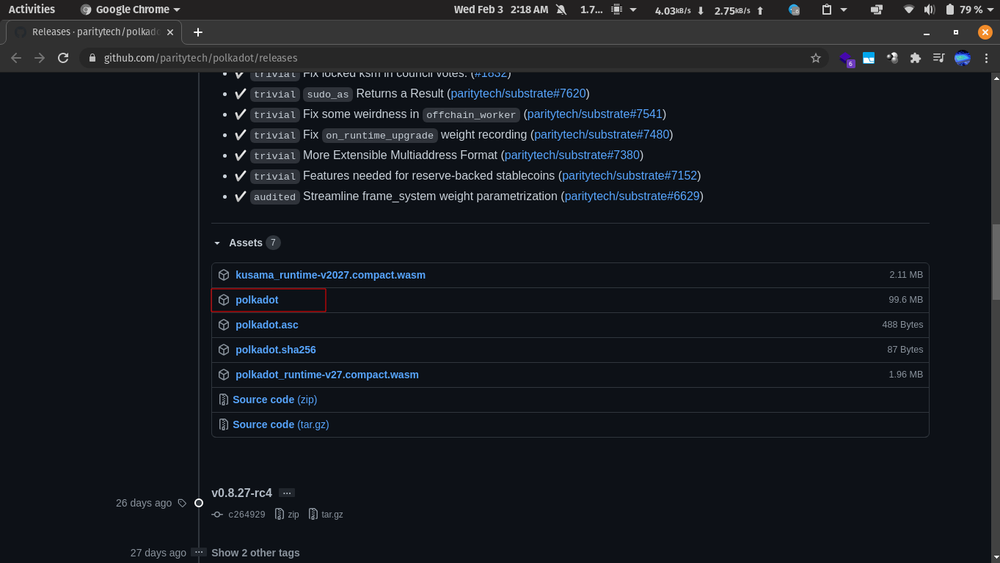
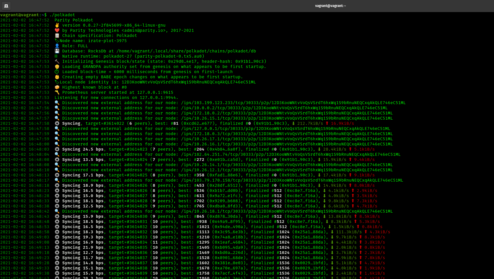

Run with binary
++++++++++++++++++++++++++++++++++++++

.. warning::

    The binary will take up all the CPU time on which node it is being run, make sure to limit the CPU usage.

Go to the following page and download the binary as shown below :

    https://github.com/paritytech/polkadot/releases

Then in the directory of the binary, open up a terminal window and execute :

.. code-block:: bash

    sudo chmod +x ./polkadot

Now to run the binary run the following command :

.. code-block:: bash

    ./polkadot

The node will be up as shown below :

