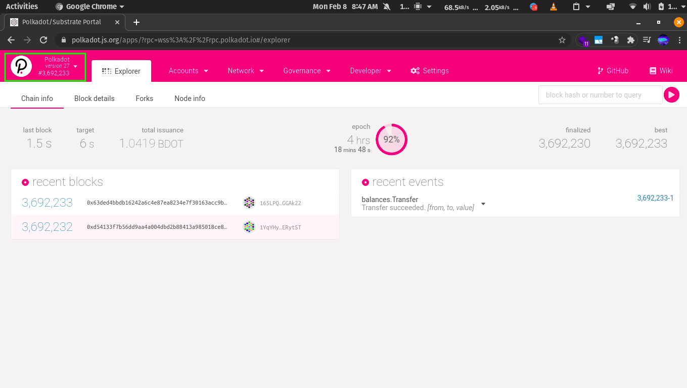
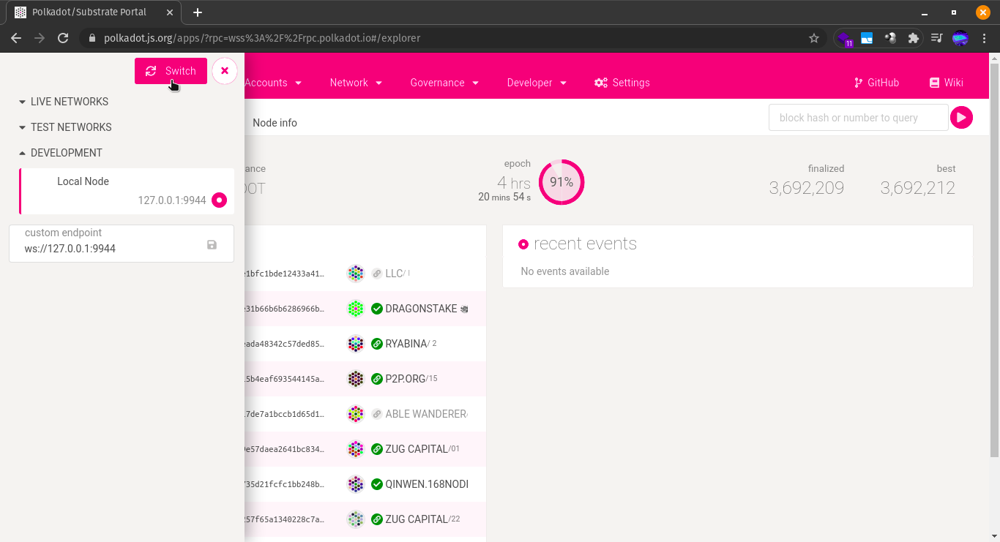
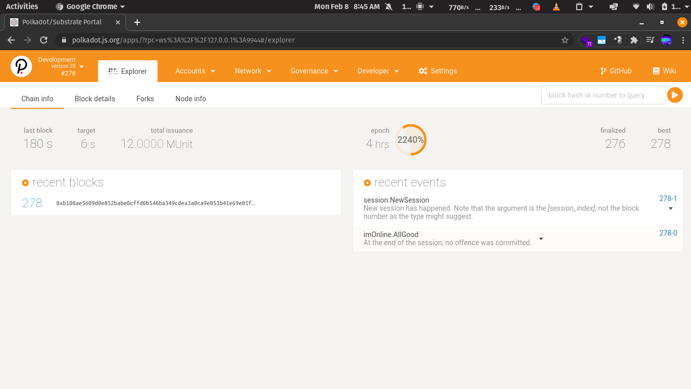
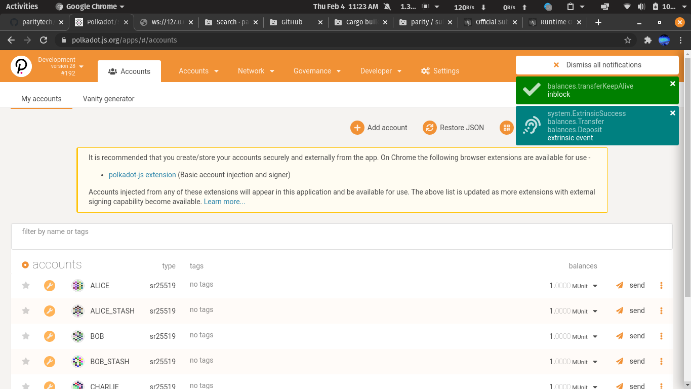

Single Node Network
++++++++++++++++++++++++++++++++++++++

Grab the source code and build it:

.. code-block:: bash

    curl https://getsubstrate.io -sSf | bash -s -- --fast

Then, grab the Polkadot source code:

.. code-block:: bash

    git clone https://github.com/paritytech/polkadot.git
    cd polkadot

Then build the code. You will need to build in release mode (--release) to start a network.
Only use debug mode for development (faster compile times for development and testing).

.. code-block:: bash

    ./scripts/init.sh   # Install WebAssembly. Update Rust
    cargo build # Builds all native code

You can run the tests if you like:

.. code-block:: bash

    cargo test --all

You can start a development chain with:

.. code-block:: bash

    cargo run -- --dev

Detailed logs may be shown by running the node with the following environment variables set:

.. code-block:: bash

    RUST_LOG=debug RUST_BACKTRACE=1 cargo run -- --dev

**Development**

You can run a simple single-node development "network" on your machine by running:

.. code-block:: bash

    polkadot --dev

The node will be up and running.

UI
==

You can muck around by heading to https://polkadot.js.org/apps and choose "Local Node" from the Settings menu:

Go to https://polkadot.js.org/apps.

Click on the Polkadot logo as shown:

Then, go to ``DEVELOPMENT`` and select your local node and click ``switch``.

Wait for the connection to be established.

.. image:: images/local3.png

The local setup will be up and running as shown:

You can do transactions in your local setup and send DOTs.

