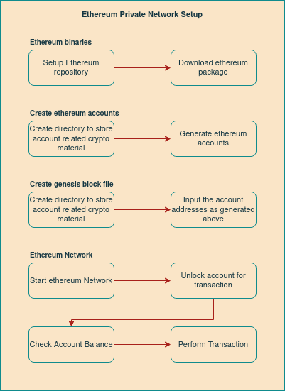

Private Ethereum Setup
=======================

In this document we are going to setup a private ethereum blockchain on your server.

We will use proof of authority (PoA) consensus to setup the private network. In PoA-based networks, transactions and blocks are validated by approved accounts, known as validators or sealer. The process is automated and does not require validators to be constantly monitoring their computers.

Steps Flow Diagram
-------------------

Prerequisites
-------------

OS: Ubuntu 18.04

RAM: 8GB

Getting Started
----------------

To create an Ethereum Private Network, we first need to have Ethereum installed in our system

Binary Installation
''''''''''''''''''''

- Install ethererum package on Ubuntu
    
    .. code-block:: bash

        sudo add-apt-repository -y ppa:ethereum/ethereum
        sudo apt-get update
        sudo apt-get install ethereum

Account Creation
''''''''''''''''

To make a transaction, we need at least two accounts: A receiver and a sender.

- Create Account for Ethereum Private Network and store them in ``privateNetwork`` directory, run the following command twice:
    
    .. code-block:: bash

        mkdir privateNetwork
        cd privateNetwork

        geth --datadir ./datadir account new
    
    .. note:: Enter passphrase for each account when asked

- List created ethereum accounts

    .. code-block:: bash

        geth account list --datadir ./datadir/
    
    .. note:: Enter the passphrase as asked and remember it to unlock account

Create Genesis Block    
'''''''''''''''''''''

A Genesis file contains the properties that define the Blockchain. A Genesis file is the start-point of the Blockchain and so, it is mandatory to create the Genesis file to create a Blockchain.

**(OR) Via Manual**

- Create ``genesis.json`` for Genesis block file

    .. code-block:: bash

        {
            "config": {
                "chainId": 2019,
                "homesteadBlock": 0,
                "eip150Block": 0,
                "eip155Block": 0,
                "eip158Block": 0,
                "byzantiumBlock": 0
            },
            "difficulty": "400",
            "gasLimit": "2000000",
            "alloc": {
                "dd5fec2c9e6e2001eb92b841509f201bf0e99c70": {
                "balance": "100000000000000000000000"
                },
                "d6ad56ecf21fc28b61ba8e402fe98ec7530a9777": {
                "balance": "120000000000000000000000"
                }
            }
        }

    .. note:: Change the address from above genesis block file to the addresses generated above using new geth new command

**Via puppeth Utility**

- Geth comes with different tools included; Puppeth is a tool to create a new genesis file by selecting different options.

    .. code:: bash

        puppeth

- Specify chainId, which will be our network name:

    .. code-block:: bash

        Please specify a network name to administer (no spaces, hyphens or capital letters please)
        > 9876

        Sweet, you can set this via --network=9876 next time!

- Select 2nd option to generate a new genesis file:

    .. code-block:: bash

        What would you like to do? (default = stats)
         1. Show network stats
         2. Configure new genesis
         3. Track new remote server
         4. Deploy network components
        > 2

        What would you like to do? (default = create)
         1. Create new genesis from scratch
         2. Import already existing genesis
        > 1

- Select proof-of-authority. 

    .. code-block:: bash

        Which consensus engine to use? (default = clique)
        1. Ethash - proof-of-work
        2. Clique - proof-of-authority
        > 2

- For the fast transaction, hence provide 1 second. 

    .. code-block:: bash

        How many seconds should blocks take? (default = 15)    
        > 1  

- Provide accounts created previously 

    .. code-block:: bash

        Which accounts are allowed to seal? (mandatory at least one)
        > 0xdd5fec2c9e6e2001eb92b841509f201bf0e99c70
        > 0xd6ad56ecf21fc28b61ba8e402fe98ec7530a9777
        > 0x

- Provide accounts to get some free ethers  

    .. code-block:: bash

        Which accounts should be pre-funded? (advisable at least one)
        > 0xdd5fec2c9e6e2001eb92b841509f201bf0e99c70
        > 0xd6ad56ecf21fc28b61ba8e402fe98ec7530a9777
        > 0x

        Should the precompile-addresses (0x1 .. 0xff) be pre-funded with 1 wei? (advisable yes)
        > yes

        Specify your chain/network ID if you want an explicit one (default = random)
        > 9876
        INFO [02-08|21:30:47.189] Configured new genesis block 

- The genesis block is configured, now we need to export the configuration into a file. 

    .. code-block:: bash

        What would you like to do? (default = stats)
        1. Show network stats
        2. Manage existing genesis
        3. Track new remote server
        4. Deploy network components
        > 2

        1. Modify existing configurations
        2. Export genesis configurations
        3. Remove genesis configuration
        > 2

        Which folder to save the genesis specs into? (default = current)
        Will create 9876.json, 9876-aleth.json, 9876-harmony.json, 9876-parity.json
        > 
        INFO [02-08|21:32:01.482] Saved native genesis chain spec          path=9876.json
        ERROR[02-08|21:32:01.483] Failed to create Aleth chain spec        err="unsupported consensus engine"
        ERROR[02-08|21:32:01.484] Failed to create Parity chain spec       err="unsupported consensus engine"
        INFO [02-08|21:32:01.487] Saved genesis chain spec                 client=harmony path=9876-harmony.json

.. note:: You should see the 9876.json created in the current directory

- Rename it to ``genesis.json``
    
    .. code-block:: bash

        mv 9876.json genesis.json

- Set block sealing period to 0, this will automatically force geth to only create a new block whenever there is a transaction in the network.

    .. code-block:: bash

        "clique": {    
            "period": 0,    
            "epoch": 30000    
        }    

Initialize the Node
''''''''''''''''''''

- Now, Instantiate the data diracrectory containing the identities
    
    .. code-block:: bash

        geth --datadir ./datadir init ./genesis.json

Run the Node
'''''''''''''

- Start Ethereum Private Network

    .. code-block:: bash

        geth --datadir ./myDataDir --networkid 1114 console 2>> Eth.log

- Unlock account for the transactions using passphrase used above while creating account
    
    .. code-block:: bash

        personal.unlockAccount(eth.accounts[0], "123")

- Check balance

    .. code-block:: bash

        web3.fromWei(eth.getBalance(eth.accounts[0]), "ether")