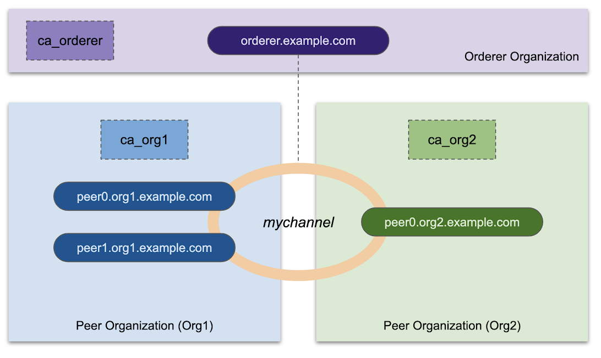
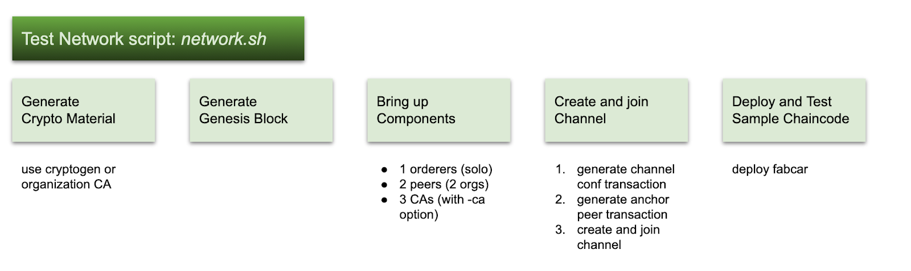
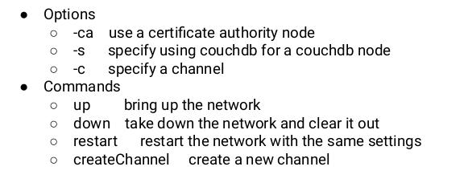
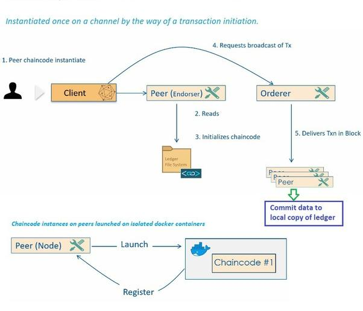

Setup HLF Test Network
++++++++++++++++++++++++

The test network is provided for learning about Fabric by running nodes on your local machine. Developers can use the network to test their smart contracts and applications. The network is meant to be used only as a tool for education and testing and not as a model for how to set up a network.

Test Network Overview
======================

Prerequisites Setup
====================

.. dropdown:: :fa:`eye,mr-1` Prerequisites setup steps for users not using ``Vagrant``
    :title: text-info font-weight-bold

    - ``git, curl`` Install

        .. code-block:: bash

            sudo apt -y install git curl

    - Install docker on Ubuntu 18.04+

        .. code-block:: bash

            sudo apt -y install docker.io

    - Enable docker service to autostart docker at startup

        .. code-block:: bash

            sudo systemctl start docker
            sudo systemctl enable docker

    - Add user to docker group for passwordless execution of docker command

        .. code-block:: bash

            sudo usermod -aG docker $(whoami)

    - Install Docker compose

        .. code-block:: bash

            sudo curl -L https://github.com/docker/compose/releases/download/1.23.1/docker-compose-$(uname -s)-$(uname -m) -o /usr/local/bin/docker-compose
            sudo chmod +x /usr/local/bin/docker-compose

.. note:: All the prerequisites are tackeld in the ``vagrant file``

Vagrant
--------

- Install Virtualbox from `here <https://www.virtualbox.org/wiki/Downloads>`_
- Install Vagrant from `here <https://www.vagrantup.com/downloads>`_
- Start Vagrant VM using below script

    .. dropdown:: :fa:`eye,mr-1` ``Vagrantfile`` script
        :title: text-info font-weight-bold

        .. note:: Change ip in line ``config.vm.network "public_network", ip: "192.168.0.235" ``according your network enviroment. 
        
        .. code-block:: bash

            # -*- mode: ruby -*-
            # vi: set ft=ruby :

            # All Vagrant configuration is done below. The "2" in Vagrant.configure
            # configures the configuration version (we support older styles for
            # backwards compatibility). Please don't change it unless you know what
            # you're doing.
            Vagrant.configure("2") do |config|
              # The most common configuration options are documented and commented below.
              # For a complete reference, please see the online documentation at
              # https://docs.vagrantup.com.

              # Every Vagrant development environment requires a box. You can search for
              # boxes at https://vagrantcloud.com/search.
              config.vm.box = "bento/ubuntu-20.04"

              config.vm.network "public_network", ip: "192.168.0.235"

              # Share an additional folder to the guest VM. The first argument is
              # the path on the host to the actual folder. The second argument is
              # the path on the guest to mount the folder. And the optional third
              # argument is a set of non-required options.
              # config.vm.synced_folder "../data", "/vagrant_data"

              config.vm.provider "virtualbox" do |vb|
              #   # Display the VirtualBox GUI when booting the machine
              #   vb.gui = true
              #
              #   # Customize the amount of memory on the VM:
                vb.cpus = 4
                vb.memory = "16384"
              end
              #
              # View the documentation for the provider you are using for more
              # information on available options.

              # Enable provisioning with a shell script. Additional provisioners such as
              # Ansible, Chef, Docker, Puppet and Salt are also available. Please see the
              # documentation for more information about their specific syntax and use.
              # config.vm.provision "shell", inline: <<-SHELL

              # SHELL
              config.vm.provision :shell, :path=>"script.sh"
            end

    .. dropdown:: :fa:`eye,mr-1` ``script.sh`` for **everyone**
        :title: text-info font-weight-bold

        .. code-block:: bash

            sudo apt update
            sudo apt upgrade -y

            # Install docker
            sudo apt install -y docker.io git curl
            sudo usermod -aG docker vagrant
            sudo service enable docker

            # Install Docker compose
            sudo curl -L https://github.com/docker/compose/releases/download/1.23.1/docker-compose-$(uname -s)-$(uname -m) -o /usr/local/bin/docker-compose
            sudo chmod +x /usr/local/bin/docker-compose

    .. dropdown:: :fa:`eye,mr-1` ``script.sh`` with docker registry
        :title: text-info font-weight-bold

        .. code-block:: bash

            sudo apt update
            sudo apt -y upgrade

            # Install docker
            sudo apt install -y docker.io git curl
            sudo usermod -aG docker vagrant
            sudo service enable docker

            # seting docker registry
            sudo cat > /etc/docker/daemon.json <<EOF
            {
              "registry-mirrors": ["https://registry.osive.com"],
              "dns": ["192.168.0.5"]
            }
            EOF

            sudo service docker restart

            # Install Docker compose
            sudo curl -L https://github.com/docker/compose/releases/download/1.23.1/docker-compose-$(uname -s)-$(uname -m) -o /usr/local/bin/docker-compose
            sudo chmod +x /usr/local/bin/docker-compose
        

- Start Vagrant VM

    .. code-block:: bash

        vagrant up

- SSH into Vagrant VM

    .. code-block:: bash

        vagrant ssh

Getting Started
================

Stepsflow Diagram
------------------

Setup platform
---------------

- Download and install ``fabric-samples``, binaries and Docker images

    curl -sSL https://bit.ly/2ysbOFE | bash -s -- <fabric_version> <fabric-ca_version>

    .. code-block:: bash

        curl -sSL https://bit.ly/2ysbOFE | bash -s -- 2.2.2 1.4.9

    .. dropdown:: :fa:`eye,mr-1` Hyperledger Fabric Setup script used in above command.
        :title: text-info font-weight-bold

        .. note:: For reference purposes only, not to be copied and used.
        
        .. code-block:: bash

            #!/bin/bash
            #
            # Copyright IBM Corp. All Rights Reserved.
            #
            # SPDX-License-Identifier: Apache-2.0
            #

            # if version not passed in, default to latest released version
            VERSION=2.3.1
            # if ca version not passed in, default to latest released version
            CA_VERSION=1.4.9
            ARCH=$(echo "$(uname -s|tr '[:upper:]' '[:lower:]'|sed 's/mingw64_nt.*/windows/')-$(uname -m | sed 's/x86_64/amd64/g')")
            MARCH=$(uname -m)

            printHelp() {
                echo "Usage: bootstrap.sh [version [ca_version]] [options]"
                echo
                echo "options:"
                echo "-h : this help"
                echo "-d : bypass docker image download"
                echo "-s : bypass fabric-samples repo clone"
                echo "-b : bypass download of platform-specific binaries"
                echo
                echo "e.g. bootstrap.sh 2.3.1 1.4.9 -s"
                echo "will download docker images and binaries for Fabric v2.3.1 and Fabric CA v1.4.9"
            }

            # dockerPull() pulls docker images from fabric and chaincode repositories
            # note, if a docker image doesn't exist for a requested release, it will simply
            # be skipped, since this script doesn't terminate upon errors.

            dockerPull() {
                #three_digit_image_tag is passed in, e.g. "1.4.7"
                three_digit_image_tag=$1
                shift
                #two_digit_image_tag is derived, e.g. "1.4", especially useful as a local tag for two digit references to most recent baseos, ccenv, javaenv, nodeenv patch releases
                two_digit_image_tag=$(echo "$three_digit_image_tag" | cut -d'.' -f1,2)
                while [[ $# -gt 0 ]]
                do
                    image_name="$1"
                    echo "====> hyperledger/fabric-$image_name:$three_digit_image_tag"
                    docker pull "hyperledger/fabric-$image_name:$three_digit_image_tag"
                    docker tag "hyperledger/fabric-$image_name:$three_digit_image_tag" "hyperledger/fabric-$image_name"
                    docker tag "hyperledger/fabric-$image_name:$three_digit_image_tag" "hyperledger/fabric-$image_name:$two_digit_image_tag"
                    shift
                done
            }

            cloneSamplesRepo() {
                # clone (if needed) hyperledger/fabric-samples and checkout corresponding
                # version to the binaries and docker images to be downloaded
                if [ -d first-network ]; then
                    # if we are in the fabric-samples repo, checkout corresponding version
                    echo "==> Already in fabric-samples repo"
                elif [ -d fabric-samples ]; then
                    # if fabric-samples repo already cloned and in current directory,
                    # cd fabric-samples
                    echo "===> Changing directory to fabric-samples"
                    cd fabric-samples
                else
                    echo "===> Cloning hyperledger/fabric-samples repo"
                    git clone -b master https://github.com/hyperledger/fabric-samples.git && cd fabric-samples
                fi

                if GIT_DIR=.git git rev-parse v${VERSION} >/dev/null 2>&1; then
                    echo "===> Checking out v${VERSION} of hyperledger/fabric-samples"
                    git checkout -q v${VERSION}
                else
                    echo "fabric-samples v${VERSION} does not exist, defaulting master"
                    git checkout -q master
                fi
            }

            # This will download the .tar.gz
            download() {
                local BINARY_FILE=$1
                local URL=$2
                echo "===> Downloading: " "${URL}"
                curl -L --retry 5 --retry-delay 3 "${URL}" | tar xz || rc=$?
                if [ -n "$rc" ]; then
                    echo "==> There was an error downloading the binary file."
                    return 22
                else
                    echo "==> Done."
                fi
            }

            pullBinaries() {
                echo "===> Downloading version ${FABRIC_TAG} platform specific fabric binaries"
                download "${BINARY_FILE}" "https://github.com/hyperledger/fabric/releases/download/v${VERSION}/${BINARY_FILE}"
                if [ $? -eq 22 ]; then
                    echo
                    echo "------> ${FABRIC_TAG} platform specific fabric binary is not available to download <----"
                    echo
                    exit
                fi

                echo "===> Downloading version ${CA_TAG} platform specific fabric-ca-client binary"
                download "${CA_BINARY_FILE}" "https://github.com/hyperledger/fabric-ca/releases/download/v${CA_VERSION}/${CA_BINARY_FILE}"
                if [ $? -eq 22 ]; then
                    echo
                    echo "------> ${CA_TAG} fabric-ca-client binary is not available to download  (Available from 1.1.0-rc1) <----"
                    echo
                    exit
                fi
            }

            pullDockerImages() {
                command -v docker >& /dev/null
                NODOCKER=$?
                if [ "${NODOCKER}" == 0 ]; then
                    FABRIC_IMAGES=(peer orderer ccenv tools)
                    case "$VERSION" in
                    2.*)
                        FABRIC_IMAGES+=(baseos)
                        shift
                        ;;
                    esac
                    echo "FABRIC_IMAGES:" "${FABRIC_IMAGES[@]}"
                    echo "===> Pulling fabric Images"
                    dockerPull "${FABRIC_TAG}" "${FABRIC_IMAGES[@]}"
                    echo "===> Pulling fabric ca Image"
                    CA_IMAGE=(ca)
                    dockerPull "${CA_TAG}" "${CA_IMAGE[@]}"
                    echo "===> List out hyperledger docker images"
                    docker images | grep hyperledger
                else
                    echo "========================================================="
                    echo "Docker not installed, bypassing download of Fabric images"
                    echo "========================================================="
                fi
            }

            DOCKER=true
            SAMPLES=true
            BINARIES=true

            # Parse commandline args pull out
            # version and/or ca-version strings first
            if [ -n "$1" ] && [ "${1:0:1}" != "-" ]; then
                VERSION=$1;shift
                if [ -n "$1" ]  && [ "${1:0:1}" != "-" ]; then
                    CA_VERSION=$1;shift
                    if [ -n  "$1" ] && [ "${1:0:1}" != "-" ]; then
                        THIRDPARTY_IMAGE_VERSION=$1;shift
                    fi
                fi
            fi

            # prior to 1.2.0 architecture was determined by uname -m
            if [[ $VERSION =~ ^1\.[0-1]\.* ]]; then
                export FABRIC_TAG=${MARCH}-${VERSION}
                export CA_TAG=${MARCH}-${CA_VERSION}
                export THIRDPARTY_TAG=${MARCH}-${THIRDPARTY_IMAGE_VERSION}
            else
                # starting with 1.2.0, multi-arch images will be default
                : "${CA_TAG:="$CA_VERSION"}"
                : "${FABRIC_TAG:="$VERSION"}"
                : "${THIRDPARTY_TAG:="$THIRDPARTY_IMAGE_VERSION"}"
            fi

            BINARY_FILE=hyperledger-fabric-${ARCH}-${VERSION}.tar.gz
            CA_BINARY_FILE=hyperledger-fabric-ca-${ARCH}-${CA_VERSION}.tar.gz

            # then parse opts
            while getopts "h?dsb" opt; do
                case "$opt" in
                    h|\?)
                        printHelp
                        exit 0
                        ;;
                    d)  DOCKER=false
                        ;;
                    s)  SAMPLES=false
                        ;;
                    b)  BINARIES=false
                        ;;
                esac
            done

            if [ "$SAMPLES" == "true" ]; then
                echo
                echo "Clone hyperledger/fabric-samples repo"
                echo
                cloneSamplesRepo
            fi
            if [ "$BINARIES" == "true" ]; then
                echo
                echo "Pull Hyperledger Fabric binaries"
                echo
                pullBinaries
            fi
            if [ "$DOCKER" == "true" ]; then
                echo
                echo "Pull Hyperledger Fabric docker images"
                echo
                pullDockerImages
            fi              

Starting Test Network
----------------------

- Navigate to ``test-network`` directory.

    .. code-block:: bash

        cd fabric-samples/test-network
  
.. dropdown:: :fa:`eye,mr-1` Solve ``_net nework not found`` error 
    :title: text-info font-weight-bold

    .. code:: bash
        
        export COMPOSE_PROJECT_NAME=fabric
                                                                                                                                                                                                                                                                                                                                                                                                                                                                                                                                                                                                                                                                        

- Start the test network with CA containers

    .. code-block:: bash

        ./network.sh up -ca

    .. dropdown:: :fa:`eye,mr-1` network.sh
        :title: text-info font-weight-bold

        .. code-block:: bash

            #!/bin/bash
            #
            # Copyright IBM Corp All Rights Reserved
            #
            # SPDX-License-Identifier: Apache-2.0
            #

            # This script brings up a Hyperledger Fabric network for testing smart contracts
            # and applications. The test network consists of two organizations with one
            # peer each, and a single node Raft ordering service. Users can also use this
            # script to create a channel deploy a chaincode on the channel
            #
            # prepending $PWD/../bin to PATH to ensure we are picking up the correct binaries
            # this may be commented out to resolve installed version of tools if desired
            export PATH=${PWD}/../bin:$PATH
            export FABRIC_CFG_PATH=${PWD}/configtx
            export VERBOSE=false

            . scripts/utils.sh

            # Obtain CONTAINER_IDS and remove them
            # TODO Might want to make this optional - could clear other containers
            # This function is called when you bring a network down
            function clearContainers() {
              CONTAINER_IDS=$(docker ps -a | awk '($2 ~ /dev-peer.*/) {print $1}')
              if [ -z "$CONTAINER_IDS" -o "$CONTAINER_IDS" == " " ]; then
                infoln "No containers available for deletion"
              else
                docker rm -f $CONTAINER_IDS
              fi
            }

            # Delete any images that were generated as a part of this setup
            # specifically the following images are often left behind:
            # This function is called when you bring the network down
            function removeUnwantedImages() {
              DOCKER_IMAGE_IDS=$(docker images | awk '($1 ~ /dev-peer.*/) {print $3}')
              if [ -z "$DOCKER_IMAGE_IDS" -o "$DOCKER_IMAGE_IDS" == " " ]; then
                infoln "No images available for deletion"
              else
                docker rmi -f $DOCKER_IMAGE_IDS
              fi
            }

            # Versions of fabric known not to work with the test network
            NONWORKING_VERSIONS="^1\.0\. ^1\.1\. ^1\.2\. ^1\.3\. ^1\.4\."

            # Do some basic sanity checking to make sure that the appropriate versions of fabric
            # binaries/images are available. In the future, additional checking for the presence
            # of go or other items could be added.
            function checkPrereqs() {
              ## Check if your have cloned the peer binaries and configuration files.
              peer version > /dev/null 2>&1

              if [[ $? -ne 0 || ! -d "../config" ]]; then
                errorln "Peer binary and configuration files not found.."
                errorln
                errorln "Follow the instructions in the Fabric docs to install the Fabric Binaries:"
                errorln "https://hyperledger-fabric.readthedocs.io/en/latest/install.html"
                exit 1
              fi
              # use the fabric tools container to see if the samples and binaries match your
              # docker images
              LOCAL_VERSION=$(peer version | sed -ne 's/ Version: //p')
              DOCKER_IMAGE_VERSION=$(docker run --rm hyperledger/fabric-tools:$IMAGETAG peer version | sed -ne 's/ Version: //p' | head -1)

              infoln "LOCAL_VERSION=$LOCAL_VERSION"
              infoln "DOCKER_IMAGE_VERSION=$DOCKER_IMAGE_VERSION"

              if [ "$LOCAL_VERSION" != "$DOCKER_IMAGE_VERSION" ]; then
                warnln "Local fabric binaries and docker images are out of  sync. This may cause problems."
              fi

              for UNSUPPORTED_VERSION in $NONWORKING_VERSIONS; do
                infoln "$LOCAL_VERSION" | grep -q $UNSUPPORTED_VERSION
                if [ $? -eq 0 ]; then
                  fatalln "Local Fabric binary version of $LOCAL_VERSION does not match the versions supported by the test network."
                fi

                infoln "$DOCKER_IMAGE_VERSION" | grep -q $UNSUPPORTED_VERSION
                if [ $? -eq 0 ]; then
                  fatalln "Fabric Docker image version of $DOCKER_IMAGE_VERSION does not match the versions supported by the test network."
                fi
              done

              ## Check for fabric-ca
              if [ "$CRYPTO" == "Certificate Authorities" ]; then

                fabric-ca-client version > /dev/null 2>&1
                if [[ $? -ne 0 ]]; then
                  errorln "fabric-ca-client binary not found.."
                  errorln
                  errorln "Follow the instructions in the Fabric docs to install the Fabric Binaries:"
                  errorln "https://hyperledger-fabric.readthedocs.io/en/latest/install.html"
                  exit 1
                fi
                CA_LOCAL_VERSION=$(fabric-ca-client version | sed -ne 's/ Version: //p')
                CA_DOCKER_IMAGE_VERSION=$(docker run --rm hyperledger/fabric-ca:$CA_IMAGETAG fabric-ca-client version | sed -ne 's/ Version: //p' | head -1)
                infoln "CA_LOCAL_VERSION=$CA_LOCAL_VERSION"
                infoln "CA_DOCKER_IMAGE_VERSION=$CA_DOCKER_IMAGE_VERSION"

                if [ "$CA_LOCAL_VERSION" != "$CA_DOCKER_IMAGE_VERSION" ]; then
                  warnln "Local fabric-ca binaries and docker images are out of sync. This may cause problems."
                fi
              fi
            }

            # Before you can bring up a network, each organization needs to generate the crypto
            # material that will define that organization on the network. Because Hyperledger
            # Fabric is a permissioned blockchain, each node and user on the network needs to
            # use certificates and keys to sign and verify its actions. In addition, each user
            # needs to belong to an organization that is recognized as a member of the network.
            # You can use the Cryptogen tool or Fabric CAs to generate the organization crypto
            # material.

            # By default, the sample network uses cryptogen. Cryptogen is a tool that is
            # meant for development and testing that can quickly create the certificates and keys
            # that can be consumed by a Fabric network. The cryptogen tool consumes a series
            # of configuration files for each organization in the "organizations/cryptogen"
            # directory. Cryptogen uses the files to generate the crypto  material for each
            # org in the "organizations" directory.

            # You can also Fabric CAs to generate the crypto material. CAs sign the certificates
            # and keys that they generate to create a valid root of trust for each organization.
            # The script uses Docker Compose to bring up three CAs, one for each peer organization
            # and the ordering organization. The configuration file for creating the Fabric CA
            # servers are in the "organizations/fabric-ca" directory. Within the same directory,
            # the "registerEnroll.sh" script uses the Fabric CA client to create the identities,
            # certificates, and MSP folders that are needed to create the test network in the
            # "organizations/ordererOrganizations" directory.

            # Create Organization crypto material using cryptogen or CAs
            function createOrgs() {
              if [ -d "organizations/peerOrganizations" ]; then
                rm -Rf organizations/peerOrganizations && rm -Rf organizations/ordererOrganizations
              fi

              # Create crypto material using cryptogen
              if [ "$CRYPTO" == "cryptogen" ]; then
                which cryptogen
                if [ "$?" -ne 0 ]; then
                  fatalln "cryptogen tool not found. exiting"
                fi
                infoln "Generating certificates using cryptogen tool"

                infoln "Creating Org1 Identities"

                set -x
                cryptogen generate --config=./organizations/cryptogen/crypto-config-org1.yaml --output="organizations"
                res=$?
                { set +x; } 2>/dev/null
                if [ $res -ne 0 ]; then
                  fatalln "Failed to generate certificates..."
                fi

                infoln "Creating Org2 Identities"

                set -x
                cryptogen generate --config=./organizations/cryptogen/crypto-config-org2.yaml --output="organizations"
                res=$?
                { set +x; } 2>/dev/null
                if [ $res -ne 0 ]; then
                  fatalln "Failed to generate certificates..."
                fi

                infoln "Creating Orderer Org Identities"

                set -x
                cryptogen generate --config=./organizations/cryptogen/crypto-config-orderer.yaml --output="organizations"
                res=$?
                { set +x; } 2>/dev/null
                if [ $res -ne 0 ]; then
                  fatalln "Failed to generate certificates..."
                fi

              fi

              # Create crypto material using Fabric CA
              if [ "$CRYPTO" == "Certificate Authorities" ]; then
                infoln "Generating certificates using Fabric CA"

                IMAGE_TAG=${CA_IMAGETAG} docker-compose -f $COMPOSE_FILE_CA up -d 2>&1

                . organizations/fabric-ca/registerEnroll.sh

              while :
                do
                  if [ ! -f "organizations/fabric-ca/org1/tls-cert.pem" ]; then
                    sleep 1
                  else
                    break
                  fi
                done

                infoln "Creating Org1 Identities"

                createOrg1

                infoln "Creating Org2 Identities"

                createOrg2

                infoln "Creating Orderer Org Identities"

                createOrderer

              fi

              infoln "Generating CCP files for Org1 and Org2"
              ./organizations/ccp-generate.sh
            }

            # Once you create the organization crypto material, you need to create the
            # genesis block of the orderer system channel. This block is required to bring
            # up any orderer nodes and create any application channels.

            # The configtxgen tool is used to create the genesis block. Configtxgen consumes a
            # "configtx.yaml" file that contains the definitions for the sample network. The
            # genesis block is defined using the "TwoOrgsOrdererGenesis" profile at the bottom
            # of the file. This profile defines a sample consortium, "SampleConsortium",
            # consisting of our two Peer Orgs. This consortium defines which organizations are
            # recognized as members of the network. The peer and ordering organizations are defined
            # in the "Profiles" section at the top of the file. As part of each organization
            # profile, the file points to a the location of the MSP directory for each member.
            # This MSP is used to create the channel MSP that defines the root of trust for
            # each organization. In essence, the channel MSP allows the nodes and users to be
            # recognized as network members. The file also specifies the anchor peers for each
            # peer org. In future steps, this same file is used to create the channel creation
            # transaction and the anchor peer updates.
            #
            #
            # If you receive the following warning, it can be safely ignored:
            #
            # [bccsp] GetDefault -> WARN 001 Before using BCCSP, please call InitFactories(). Falling back to bootBCCSP.
            #
            # You can ignore the logs regarding intermediate certs, we are not using them in
            # this crypto implementation.

            # Generate orderer system channel genesis block.
            function createConsortium() {
              which configtxgen
              if [ "$?" -ne 0 ]; then
                fatalln "configtxgen tool not found."
              fi

              infoln "Generating Orderer Genesis block"

              # Note: For some unknown reason (at least for now) the block file can't be
              # named orderer.genesis.block or the orderer will fail to launch!
              set -x
              configtxgen -profile TwoOrgsOrdererGenesis -channelID system-channel -outputBlock ./system-genesis-block/genesis.block
              res=$?
              { set +x; } 2>/dev/null
              if [ $res -ne 0 ]; then
                fatalln "Failed to generate orderer genesis block..."
              fi
            }

            # After we create the org crypto material and the system channel genesis block,
            # we can now bring up the peers and ordering service. By default, the base
            # file for creating the network is "docker-compose-test-net.yaml" in the ``docker``
            # folder. This file defines the environment variables and file mounts that
            # point the crypto material and genesis block that were created in earlier.

            # Bring up the peer and orderer nodes using docker compose.
            function networkUp() {
              checkPrereqs
              # generate artifacts if they don't exist
              if [ ! -d "organizations/peerOrganizations" ]; then
                createOrgs
                createConsortium
              fi

              COMPOSE_FILES="-f ${COMPOSE_FILE_BASE}"

              if [ "${DATABASE}" == "couchdb" ]; then
                COMPOSE_FILES="${COMPOSE_FILES} -f ${COMPOSE_FILE_COUCH}"
              fi

              IMAGE_TAG=$IMAGETAG docker-compose ${COMPOSE_FILES} up -d 2>&1

              docker ps -a
              if [ $? -ne 0 ]; then
                fatalln "Unable to start network"
              fi
            }

            # call the script to create the channel, join the peers of org1 and org2,
            # and then update the anchor peers for each organization
            function createChannel() {
              # Bring up the network if it is not already up.

              if [ ! -d "organizations/peerOrganizations" ]; then
                infoln "Bringing up network"
                networkUp
              fi

              # now run the script that creates a channel. This script uses configtxgen once
              # more to create the channel creation transaction and the anchor peer updates.
              # configtx.yaml is mounted in the cli container, which allows us to use it to
              # create the channel artifacts
              scripts/createChannel.sh $CHANNEL_NAME $CLI_DELAY $MAX_RETRY $VERBOSE
            }

            ## Call the script to deploy a chaincode to the channel
            function deployCC() {
              scripts/deployCC.sh $CHANNEL_NAME $CC_NAME $CC_SRC_PATH $CC_SRC_LANGUAGE $CC_VERSION $CC_SEQUENCE $CC_INIT_FCN $CC_END_POLICY $CC_COLL_CONFIG $CLI_DELAY $MAX_RETRY $VERBOSE

              if [ $? -ne 0 ]; then
                fatalln "Deploying chaincode failed"
              fi
            }

            # Tear down running network
            function networkDown() {
              # stop org3 containers also in addition to org1 and org2, in case we were running sample to add org3
              docker-compose -f $COMPOSE_FILE_BASE -f $COMPOSE_FILE_COUCH -f $COMPOSE_FILE_CA down --volumes --remove-orphans
              docker-compose -f $COMPOSE_FILE_COUCH_ORG3 -f $COMPOSE_FILE_ORG3 down --volumes --remove-orphans
              # Don't remove the generated artifacts -- note, the ledgers are always removed
              if [ "$MODE" != "restart" ]; then
                # Bring down the network, deleting the volumes
                #Cleanup the chaincode containers
                clearContainers
                #Cleanup images
                removeUnwantedImages
                # remove orderer block and other channel configuration transactions and certs
                docker run --rm -v $(pwd):/data busybox sh -c 'cd /data && rm -rf system-genesis-block/*.block organizations/peerOrganizations organizations/ordererOrganizations'
                ## remove fabric ca artifacts
                docker run --rm -v $(pwd):/data busybox sh -c 'cd /data && rm -rf organizations/fabric-ca/org1/msp organizations/fabric-ca/org1/tls-cert.pem organizations/fabric-ca/org1/ca-cert.pem organizations/fabric-ca/org1/IssuerPublicKey organizations/fabric-ca/org1/IssuerRevocationPublicKey organizations/fabric-ca/org1/fabric-ca-server.db'
                docker run --rm -v $(pwd):/data busybox sh -c 'cd /data && rm -rf organizations/fabric-ca/org2/msp organizations/fabric-ca/org2/tls-cert.pem organizations/fabric-ca/org2/ca-cert.pem organizations/fabric-ca/org2/IssuerPublicKey organizations/fabric-ca/org2/IssuerRevocationPublicKey organizations/fabric-ca/org2/fabric-ca-server.db'
                docker run --rm -v $(pwd):/data busybox sh -c 'cd /data && rm -rf organizations/fabric-ca/ordererOrg/msp organizations/fabric-ca/ordererOrg/tls-cert.pem organizations/fabric-ca/ordererOrg/ca-cert.pem organizations/fabric-ca/ordererOrg/IssuerPublicKey organizations/fabric-ca/ordererOrg/IssuerRevocationPublicKey organizations/fabric-ca/ordererOrg/fabric-ca-server.db'
                docker run --rm -v $(pwd):/data busybox sh -c 'cd /data && rm -rf addOrg3/fabric-ca/org3/msp addOrg3/fabric-ca/org3/tls-cert.pem addOrg3/fabric-ca/org3/ca-cert.pem addOrg3/fabric-ca/org3/IssuerPublicKey addOrg3/fabric-ca/org3/IssuerRevocationPublicKey addOrg3/fabric-ca/org3/fabric-ca-server.db'
                # remove channel and script artifacts
                docker run --rm -v $(pwd):/data busybox sh -c 'cd /data && rm -rf channel-artifacts log.txt *.tar.gz'
              fi
            }

            # Obtain the OS and Architecture string that will be used to select the correct
            # native binaries for your platform, e.g., darwin-amd64 or linux-amd64
            OS_ARCH=$(echo "$(uname -s | tr '[:upper:]' '[:lower:]' | sed 's/mingw64_nt.*/windows/')-$(uname -m | sed 's/x86_64/amd64/g')" | awk '{print tolower($0)}')
            # Using crpto vs CA. default is cryptogen
            CRYPTO="cryptogen"
            # timeout duration - the duration the CLI should wait for a response from
            # another container before giving up
            MAX_RETRY=5
            # default for delay between commands
            CLI_DELAY=3
            # channel name defaults to "mychannel"
            CHANNEL_NAME="mychannel"
            # chaincode name defaults to "NA"
            CC_NAME="NA"
            # chaincode path defaults to "NA"
            CC_SRC_PATH="NA"
            # endorsement policy defaults to "NA". This would allow chaincodes to use the majority default policy.
            CC_END_POLICY="NA"
            # collection configuration defaults to "NA"
            CC_COLL_CONFIG="NA"
            # chaincode init function defaults to "NA"
            CC_INIT_FCN="NA"
            # use this as the default docker-compose yaml definition
            COMPOSE_FILE_BASE=docker/docker-compose-test-net.yaml
            # docker-compose.yaml file if you are using couchdb
            COMPOSE_FILE_COUCH=docker/docker-compose-couch.yaml
            # certificate authorities compose file
            COMPOSE_FILE_CA=docker/docker-compose-ca.yaml
            # use this as the docker compose couch file for org3
            COMPOSE_FILE_COUCH_ORG3=addOrg3/docker/docker-compose-couch-org3.yaml
            # use this as the default docker-compose yaml definition for org3
            COMPOSE_FILE_ORG3=addOrg3/docker/docker-compose-org3.yaml
            #
            # chaincode language defaults to "NA"
            CC_SRC_LANGUAGE="NA"
            # Chaincode version
            CC_VERSION="1.0"
            # Chaincode definition sequence
            CC_SEQUENCE=1
            # default image tag
            IMAGETAG="latest"
            # default ca image tag
            CA_IMAGETAG="latest"
            # default database
            DATABASE="leveldb"

            # Parse commandline args

            ## Parse mode
            if [[ $# -lt 1 ]] ; then
              printHelp
              exit 0
            else
              MODE=$1
              shift
            fi

            # parse a createChannel subcommand if used
            if [[ $# -ge 1 ]] ; then
              key="$1"
              if [[ "$key" == "createChannel" ]]; then
                  export MODE="createChannel"
                  shift
              fi
            fi

            # parse flags

            while [[ $# -ge 1 ]] ; do
              key="$1"
              case $key in
              -h )
                printHelp $MODE
                exit 0
                ;;
              -c )
                CHANNEL_NAME="$2"
                shift
                ;;
              -ca )
                CRYPTO="Certificate Authorities"
                ;;
              -r )
                MAX_RETRY="$2"
                shift
                ;;
              -d )
                CLI_DELAY="$2"
                shift
                ;;
              -s )
                DATABASE="$2"
                shift
                ;;
              -ccl )
                CC_SRC_LANGUAGE="$2"
                shift
                ;;
              -ccn )
                CC_NAME="$2"
                shift
                ;;
              -ccv )
                CC_VERSION="$2"
                shift
                ;;
              -ccs )
                CC_SEQUENCE="$2"
                shift
                ;;
              -ccp )
                CC_SRC_PATH="$2"
                shift
                ;;
              -ccep )
                CC_END_POLICY="$2"
                shift
                ;;
              -cccg )
                CC_COLL_CONFIG="$2"
                shift
                ;;
              -cci )
                CC_INIT_FCN="$2"
                shift
                ;;
              -i )
                IMAGETAG="$2"
                shift
                ;;
              -cai )
                CA_IMAGETAG="$2"
                shift
                ;;
              -verbose )
                VERBOSE=true
                shift
                ;;
              * )
                errorln "Unknown flag: $key"
                printHelp
                exit 1
                ;;
              esac
              shift
            done

            # Are we generating crypto material with this command?
            if [ ! -d "organizations/peerOrganizations" ]; then
              CRYPTO_MODE="with crypto from '${CRYPTO}'"
            else
              CRYPTO_MODE=""
            fi

            # Determine mode of operation and printing out what we asked for
            if [ "$MODE" == "up" ]; then
              infoln "Starting nodes with CLI timeout of '${MAX_RETRY}' tries and CLI delay of '${CLI_DELAY}' seconds and using database '${DATABASE}' ${CRYPTO_MODE}"
            elif [ "$MODE" == "createChannel" ]; then
              infoln "Creating channel '${CHANNEL_NAME}'."
              infoln "If network is not up, starting nodes with CLI timeout of '${MAX_RETRY}' tries and CLI delay of '${CLI_DELAY}' seconds and using database '${DATABASE} ${CRYPTO_MODE}"
            elif [ "$MODE" == "down" ]; then
              infoln "Stopping network"
            elif [ "$MODE" == "restart" ]; then
              infoln "Restarting network"
            elif [ "$MODE" == "deployCC" ]; then
              infoln "deploying chaincode on channel '${CHANNEL_NAME}'"
            else
              printHelp
              exit 1
            fi

            if [ "${MODE}" == "up" ]; then
              networkUp
            elif [ "${MODE}" == "createChannel" ]; then
              createChannel
            elif [ "${MODE}" == "deployCC" ]; then
              deployCC
            elif [ "${MODE}" == "down" ]; then
              networkDown
            else
              printHelp
              exit 1
            fi

- Create and join channel
    
    .. code-block:: bash

        ./network.sh createChannel

Deploy sample chaincode
------------------------

- Deploy and start a sample chaincode on the channel

    .. code-block:: bash

        ./network.sh deployCC -ccn basic -ccp ../asset-transfer-basic/chaincode-javascript -ccl javascript

- Set system enviroment variables for using binaries

    .. code-block:: bash

        export PATH=${PWD}/../bin:$PATH
        export FABRIC_CFG_PATH=$PWD/../config/
    
- Invoking chaincode pretending ORG1

    .. code-block:: bash

        # Environment variables for Org1

        export CORE_PEER_TLS_ENABLED=true
        export CORE_PEER_LOCALMSPID="Org1MSP"
        export CORE_PEER_TLS_ROOTCERT_FILE=${PWD}/organizations/peerOrganizations/org1.example.com/peers/peer0.org1.example.com/tls/ca.crt
        export CORE_PEER_MSPCONFIGPATH=${PWD}/organizations/peerOrganizations/org1.example.com/users/Admin@org1.example.com/msp
        export CORE_PEER_ADDRESS=localhost:7051

    
- Run command to initialize the ledger with assets

    .. code-block:: bash

        peer chaincode invoke \
        -o localhost:7050 \
        --ordererTLSHostnameOverride orderer.example.com \
        --tls \
        --cafile ${PWD}/organizations/ordererOrganizations/example.com/orderers/orderer.example.com/msp/tlscacerts/tlsca.example.com-cert.pem \
        -C mychannel \
        -n basic \
        --peerAddresses localhost:7051 \
        --tlsRootCertFiles ${PWD}/organizations/peerOrganizations/org1.example.com/peers/peer0.org1.example.com/tls/ca.crt \
        --peerAddresses localhost:9051 \
        --tlsRootCertFiles ${PWD}/organizations/peerOrganizations/org2.example.com/peers/peer0.org2.example.com/tls/ca.crt \
        -c '{"function":"InitLedger","Args":[]}'

- Query the ledger to get list of assets

    .. code-block:: bash

        peer chaincode query \
        -C mychannel \
        -n basic \
        -c '{"Args":["GetAllAssets"]}'

- Querying chaincode pretending ORG2

    .. code-block:: bash

        # Environment variables for Org2

        export CORE_PEER_TLS_ENABLED=true
        export CORE_PEER_LOCALMSPID="Org2MSP"
        export CORE_PEER_TLS_ROOTCERT_FILE=${PWD}/organizations/peerOrganizations/org2.example.com/peers/peer0.org2.example.com/tls/ca.crt
        export CORE_PEER_MSPCONFIGPATH=${PWD}/organizations/peerOrganizations/org2.example.com/users/Admin@org2.example.com/msp
        export CORE_PEER_ADDRESS=localhost:9051

- Query the ledger to get list of assets as ORG2

    .. code-block:: bash

        peer chaincode query -C mychannel -n basic -c '{"Args":["ReadAsset","asset6"]}'

    
Destroy network
---------------

- Destroy the network using below command

    .. code-block:: bash

        ./network.sh down

Deploy chaincode in Development
-------------------------------

In this step we will be deploying our chaincode while in development.

Chaincode Lifecycle Flow
''''''''''''''''''''''''''

- Develop chaincode. For eg.

    .. code-block:: javascript

        const { Contract } = require('fabric-contract-api');
        class TestChain extends Contract {
            async initLedger(ctx) {
                console.info('=== END : Initialize Ledger ===');
            }
            async helloWorld(ctx) {
                return "Hello World";
            }
        }
        module.exports = TestChain;

Prepare Enviroment as Org1
'''''''''''''''''''''''''''

    .. code-block:: bash

        export CORE_PEER_LOCALMSPID="Org1MSP"
        export FABRIC_CFG_PATH=$PWD/../config/
        export CORE_PEER_TLS_ENABLED=true
        export CORE_PEER_TLS_ROOTCERT_FILE=${PWD}/organizations/peerOrganizations/org1.example.com/peers/peer0.org1.example.com/tls/ca.crt
        export CORE_PEER_MSPCONFIGPATH=${PWD}/organizations/peerOrganizations/org1.example.com/users/Admin@org1.example.com/msp
        export CORE_PEER_ADDRESS=localhost:7051

Package Chaincode
''''''''''''''''''

Make sure to change the chaincode path in the below command

    .. code-block::  javascript

        export PATH=${PWD}/../bin:$PATH
        export FABRIC_CFG_PATH=$PWD/../config/
        peer version
        peer lifecycle chaincode package testchain.tar.gz \--path <chaincode path> --lang node --label testchain_1

    .. note:: Do check the generated testchain.tar.gz in the working directory
    

Install Chaincode
''''''''''''''''''

    Install chaincode as Org1

    .. code-block:: bash

        peer lifecycle chaincode install testchain.tar.gz

Approve chaincode
'''''''''''''''''''

- Check for installed chaincode and package id.

    .. code-block:: bash

        peer lifecycle chaincode queryinstalled

    .. note:: copy the package id from the output.

- Create enviroment variable for chaincode id

    .. code-block:: bash

        export CC_PACKAGE_ID=testchain_1:{packageid from return from query command}

- Approve the chaincode installed as Org1.
  
    .. code-block:: bash

        peer lifecycle chaincode approveformyorg \
        -o localhost:7050 \
        --ordererTLSHostnameOverride orderer.example.com \
        --channelID mychannel \
        --name testchain \
        --version 1.0 \
        --package-id $CC_PACKAGE_ID \
        --sequence 1 \
        --tls \
        --cafile ${PWD}/organizations/ordererOrganizations/example.com/orderers/orderer.example.com/msp/tlsca certs/tlsca.example.com-cert.pem

Commit chaincode
'''''''''''''''''

- Check commit readiness i.e. if the organisations has approved

    .. code-block:: bash

        peer lifecycle chaincode checkcommitreadiness \
        --channelID mychannel \
        --name testchain \
        --version 1.0 \
        --sequence 1 \
        --tls \
        --cafile ${PWD}/organizations/ordererOrganizations/example.com/orderers/orderer.example.com/msp/tlscacerts/tlsca.example.com-cert.pem \
        --output json

- Commit chaincode to the network

    .. code-block:: bash

        peer lifecycle chaincode commit \
        -o localhost:7050 \
        --ordererTLSHostnameOverride orderer.example.com \
        --channelID mychannel \
        --name testchain \
        --version 1.0 \
        --sequence 1 \
        --tls \
        --cafile ${PWD}/organizations/ordererOrganizations/example.com/orderers/orderer.example.com/msp/tlscacerts/tlsca.example.com-cert.pem \
        --peerAddresses localhost:7051 \
        --tlsRootCertFiles ${PWD}/organizations/peerOrganizations/org1.example.com/peers/peer0.org1.example.com/tls/ca.crt \
        --peerAddresses localhost:9051 \
        --tlsRootCertFiles ${PWD}/organizations/peerOrganizations/org2.example.com/peers/peer0.org2.example.com/tls/ca.crt

Verify Chaincode Commit
''''''''''''''''''''''''

    .. code-block:: bash

        peer lifecycle chaincode querycommitted \
        --channelID mychannel \
        --name testchain \
        --cafile ${PWD}/organizations/ordererOrganizations/example.com/orderers/orderer.example.com/msp/tlscacerts/tlsca.example.com-cert.pem \

Invoke Chaincode
'''''''''''''''''

- Invoke chaincode installed above
  
    .. code-block:: bash

        peer chaincode invoke \
        -o localhost:7050 \
        --ordererTLSHostnameOverride orderer.example.com \
        --tls \
        --cafile ${PWD}/organizations/ordererOrganizations/example.com/orderers/orderer.example.com/msp/tlscacerts/tlsca.example.com-cert.pem \
        -C mychannel \
        -n testchain \
        --peerAddresses localhost:7051 \
        --tlsRootCertFiles ${PWD}/organizations/peerOrganizations/org1.example.com/peers/peer0.org1.example.com/tls/ca.crt \
        --peerAddresses localhost:9051 \
        --tlsRootCertFiles ${PWD}/organizations/peerOrganizations/org2.example.com/peers/peer0.org2.example.com/tls/ca.crt -c '{"function":"initLedger","Args":[]}'

- Query chaincode for arguments

    .. code-block:: bash

        peer chaincode query -C mychannel -n testchain -c '{"Args":["helloWorld"]}'

Upgrade Chaincode
''''''''''''''''''

After updation of chaincode, we need to reinstall, approve and commit the code

- Package chaincode

    .. code-block:: bash

        peer lifecycle chaincode package testchain_2.tar.gz --path <chaincode path> --lang node --label testchain_2

    .. note:: Change the version number of the chaincode package above

- Reinstall chaincode

    .. code-block:: bash

        peer lifecycle chaincode install testchain_2.tar.gz

- Query for installed chaincode

    .. code-block:: bash

        peer lifecycle chaincode queryinstalled

- Export chaincode package id using output from above command

    .. code-block:: bash

        export NEW_CC_PACKAGE_ID=testchain_2:{id from previous command}

- Approve chaincode as Org1

    .. code-block:: bash

        peer lifecycle chaincode approveformyorg \
        -o localhost:7050 \
        --ordererTLSHostnameOverride orderer.example.com \
        --channelID mychannel \
        --name testchain \
        --version 2.0 \
        --package-id $NEW_CC_PACKAGE_ID \
        --sequence 2 \
        --tls \
        --cafile ${PWD}/organizations/ordererOrganizations/example.com/orderers/orderer.example.com/msp/tlscacerts/tlsca.example.com-cert.pem

- Check commit readiness

    .. code-block:: bash

        peer lifecycle chaincode checkcommitreadiness \
        --channelID mychannel \
        --name testchain \
        --version 2.0 \
        --sequence 2 \
        --tls \
        --cafile ${PWD}/organizations/ordererOrganizations/example.com/orderers/orderer.example.com/msp/tlscacerts/tlsca.example.com-cert.pem \
        --output json

- Commit chaincode to the fabric Network

    .. code-block:: bash

        peer lifecycle chaincode commit \
        -o localhost:7050 \
        --ordererTLSHostnameOverride orderer.example.com \
        --channelID mychannel \
        --name testchain \
        --version 2.0 \
        --sequence 2 \
        --tls \
        --cafile ${PWD}/organizations/ordererOrganizations/example.com/orderers/orderer.example.com/msp/tlscacerts/tlsca.example.com-cert.pem \
        --peerAddresses localhost:7051 \
        --tlsRootCertFiles ${PWD}/organizations/peerOrganizations/org1.example.com/peers/peer0.org1.example.com/tls/ca.crt \
        --peerAddresses localhost:9051 \
        --tlsRootCertFiles ${PWD}/organizations/peerOrganizations/org2.example.com/peers/peer0.org2.example.com/tls/ca.crt

Chaincode to store and retrieve JSON data
===========================================

Create a local wallet and use the Fabric SDK to call your chaincode
=========================================================================

Add a second and third peer node to your network each with a different organization.
=====================================================================================

Join the new peers to the channel and endorse them for the chaincode
===========================================================================

JSON data to CouchDB and query the data.
==========================================

Create chaincode and web dApp to represent an enterprise workflow
======================================================================

